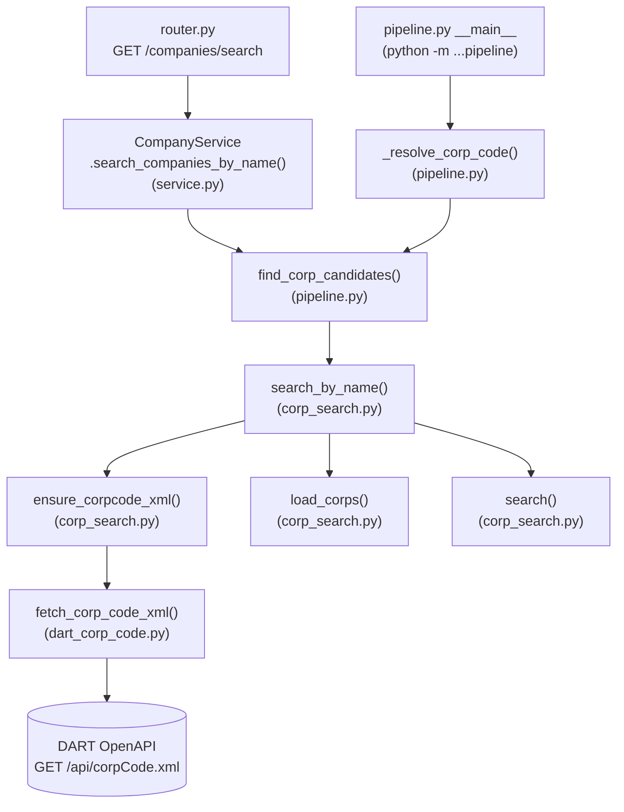

# 기업 조회 호출 맵

## 분석 대상 파일

- `apps/backend/app/domain/company/api/corp_search.py`
- `apps/backend/app/domain/company/pipeline.py`
- `apps/backend/app/domain/company/service.py`
- `apps/backend/app/domain/company/router.py`

## 함수 호출 맵



## 설명

기업명 검색 흐름은 다음 계층 구조를 따른다.

```text
API / Router  ->  Company Service  ->  Company Pipeline  ->  Corp Search 및 하위 구현
```

- **`router.py`**: `GET /companies/search` 엔드포인트가 `CompanyService.search_companies_by_name()`을 호출한다. 라우터는 `pipeline.py`나 `corp_search.py`를 직접 호출하지 않는다.
- **`service.py`**: `CompanyService.search_companies_by_name()`이 진입점이며, `pipeline.py`의 `find_corp_candidates()`를 호출한다. `service.py`는 `corp_search.py`를 직접 import하지 않는다.
- **`pipeline.py`**: 기업 조회 작업의 orchestration 계층.
  - `find_corp_candidates()`: 회사명으로 `corp_search.search_by_name()`을 호출하는 공개 래퍼. 서비스와 CLI가 모두 이 함수를 통해서만 검색 기능을 쓴다.
  - `_resolve_corp_code()`: CLI(`__main__`) 전용 헬퍼로, `find_corp_candidates()`의 결과를 받아 후보가 1건이면 확정하고, 여러 건이면 목록을 출력한 뒤 사용자가 `--corp-code`로 특정하게 한다.
- **`corp_search.py`**: 하위 구현 모듈. `search_by_name()`이 "캐시 확인(`ensure_corpcode_xml`) → 파싱(`load_corps`) → 부분 일치(`search`)" 3단계를 수행한다. 캐시가 없거나 14일을 넘으면 `ensure_corpcode_xml()`이 다른 파일(`dart_corp_code.py`)의 `fetch_corp_code_xml()`을 호출해 DART Open API(`corpCode.xml`)에서 새로 받는다. 이 모듈은 자체 실행 진입점(`__main__`)을 갖지 않으며, 상위 계층(`service.py`, `router.py`)이 직접 호출하지 않는다.
- `normalize()`, `_age_days()`와 같은 문자열 정규화·파일 나이 계산용 세부 함수는 호출 흐름 파악에 필요하지 않아 다이어그램에서 제외했다.
